# 6502 motherboard v2

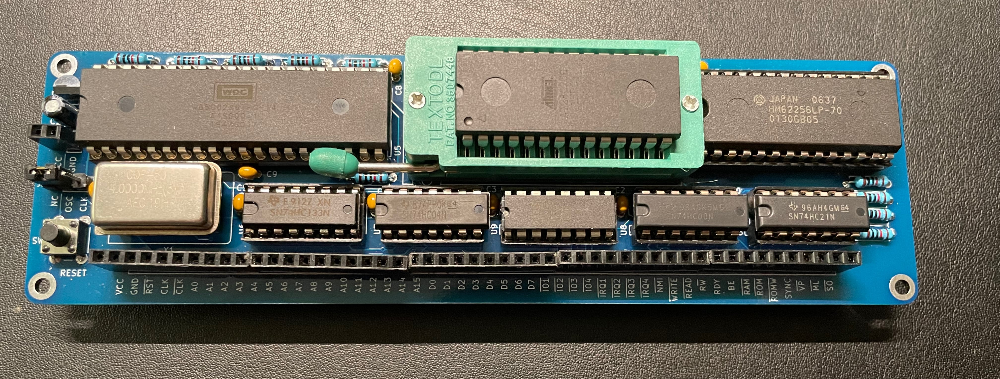

I've been following Ben Eater's tutorials on building a 6502 computer and got frustrated after some time with the breadboard wiring. First, with the improvements I made to the address decoding, it all became a mess. Then, as I started working on the video card, plugging in those Dupont cables next to the CPU got tedious, not to mention extricating the ROM chip for each code update. Now that the basic structure of the computer was mostly done, it was time for a PCB. Enter this board!

## Features

- Based on Ben Eater's 6502 computer
- Using female pin headers with long legs, plugs into my existing breadboard project and supports jumper cables
- All signals from the CPU and glue logic exposed and clearly labeled, keeping full expandability
- Re-built memory map to enable the full 32k of RAM and 4 I/O devices (each with 16 bits of address space, dedicated select and IRQ lines)
- Zero insertion force socket to quickly get the ROM chip in and out
- Power-on reset circuit, so I don't have to press the reset button when cycling the power
- Can be clocked by a built-in oscillator or an external clock
- Can be powered by the breadboard or via a dedicated pin header

# More pictures

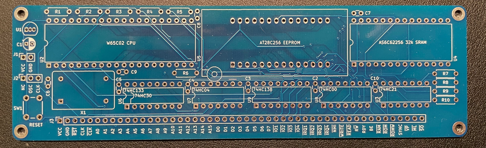

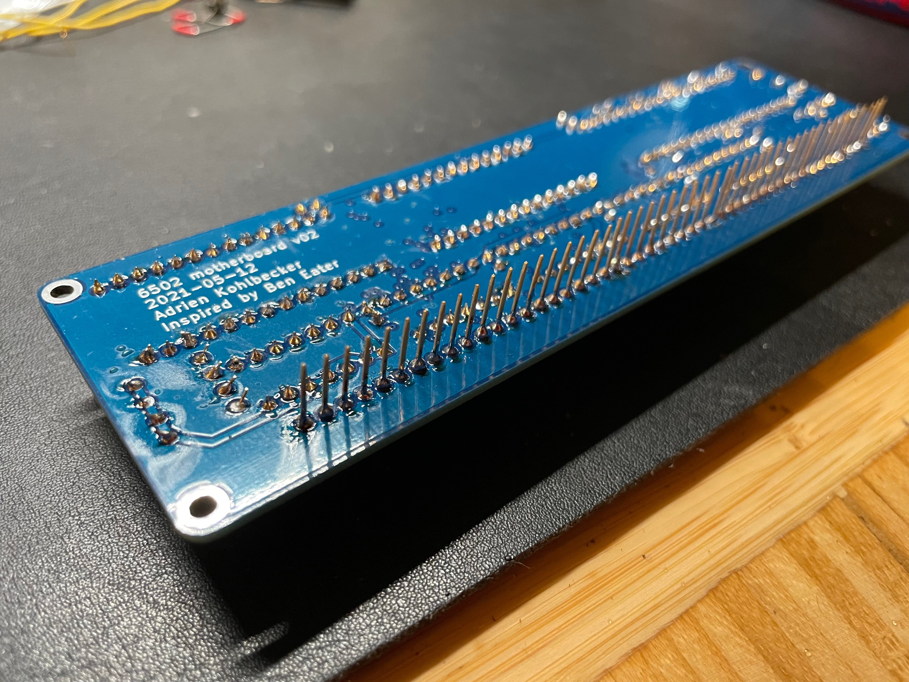

| Before                                                       | After                                                       |
| ------------------------------------------------------------ | ----------------------------------------------------------- |
| 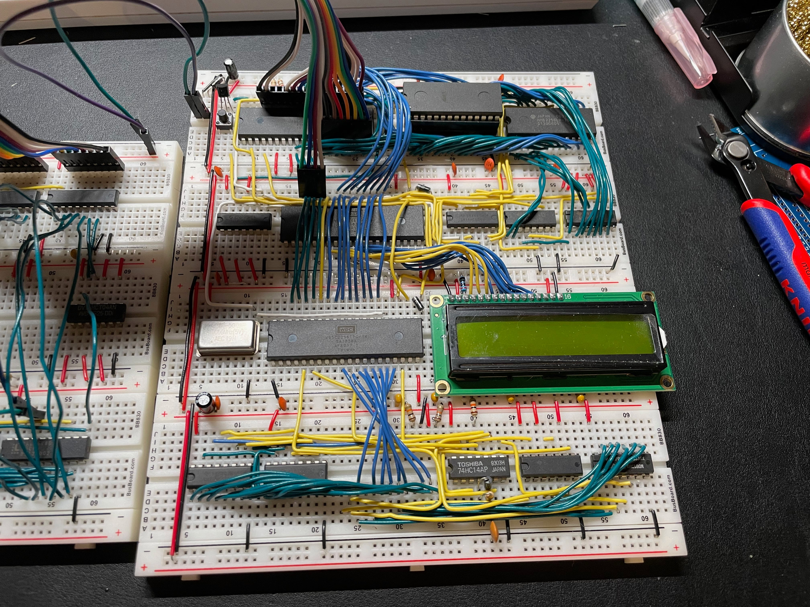 | 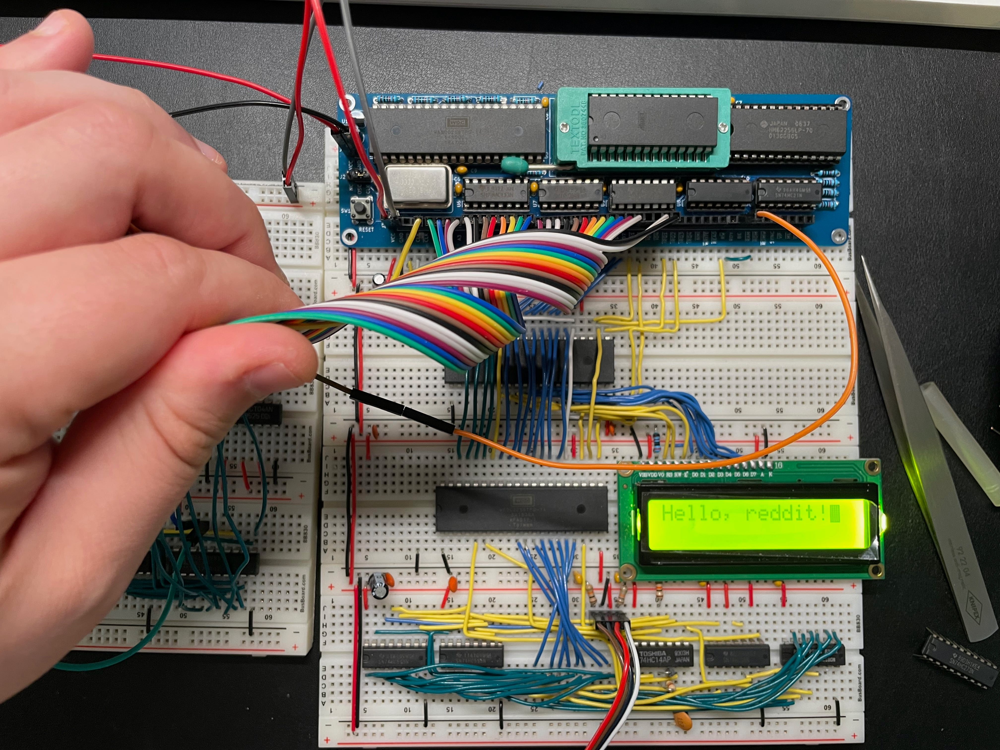 |

# Schematics

## Main sheet

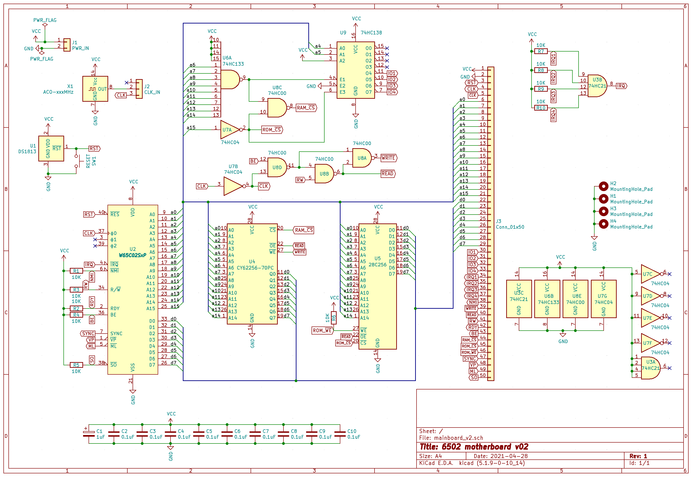

## CPU, ROM & RAM section

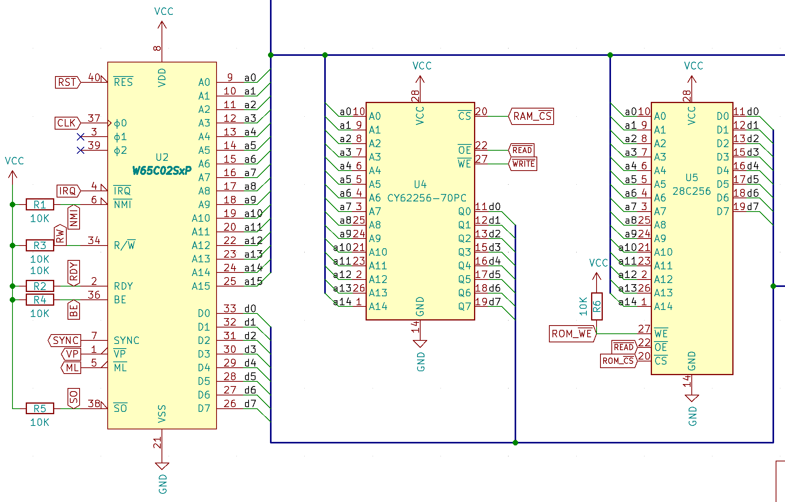

This is a pretty standard section. A few things to note:

- All input pins going to the expansion port have 10k pull-up resistors, so they can be driven high or low externally, and they default to high if not plugged in.
- I'm not wiring the Phi1 and Phi2 ports from the CPU, as WDC discourages their use in the datasheet.
- Contrary to Ben's build, the ROM only outputs when a read cycle occurs. I plan to use this address space for writes to a frame buffer memory. This also saves the ROM if you were to advertently try to write to this address space.
- I wired the ROM's write-enable to the expansion port to play with building an EEPROM programmer later.

## Address decoding

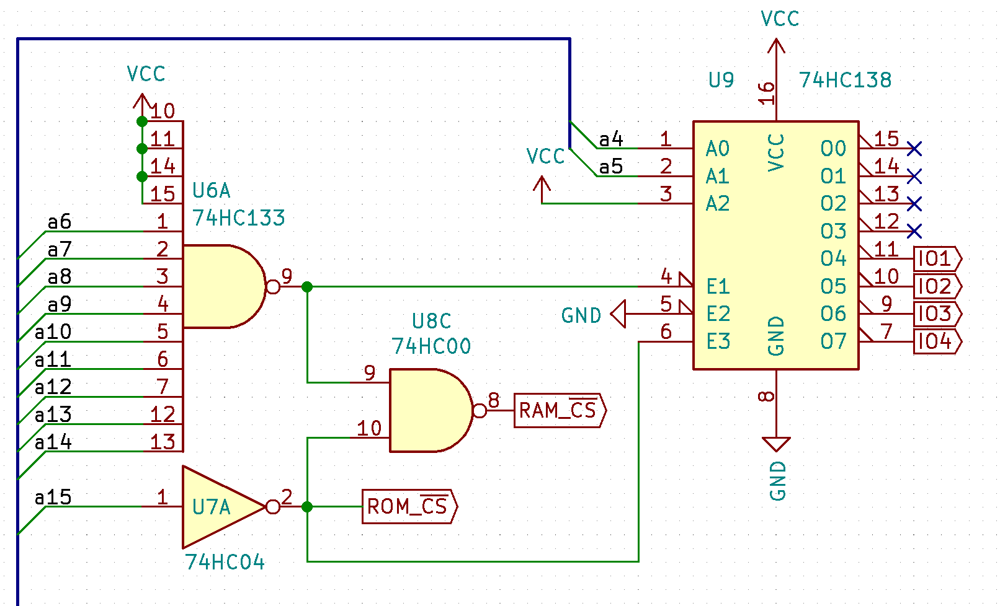

This section takes in the address lines and provides select lines for the ROM, RAM, and I/O ports.

- By using a 74HC133 13-input NAND gate, I'm able to make much more efficient use of the address space than Ben's build (See below)
- Since the 74HC133 is obsolete and can be hard to find, I've also made the pinout compatible with a 74HC30 8-input NAND gate. In this case, addresses from `7F80` to `7FBF` are inaccessible (64 bytes).
- Each I/O port gets 16 addresses, which is what VIAs need. Other chips I plan to use only need 4, like the ACIA, so 16 should cover most cases.

### Memory map

| Binary Range                                  | Hex Range       | Description |
| --------------------------------------------- | --------------- | ----------- |
| `0000 0000 0000 0000` - `0000 0000 1111 1111` | `0000` - `00FF` | Zero page   |
| `0000 0001 0000 0000` - `0000 0001 1111 1111` | `0100` - `01FF` | Stack       |
| `0000 0010 0000 0000` - `0111 1111 1011 1111` | `0200` - `7FBF` | RAM         |
| `0111 1111 1100 0000` - `0111 1111 1100 1111` | `7FC0` - `7FCF` | I/O #1      |
| `0111 1111 1101 0000` - `0111 1111 1101 1111` | `7FD0` - `7FDF` | I/O #2      |
| `0111 1111 1110 0000` - `0111 1111 1110 1111` | `7FE0` - `7FEF` | I/O #3      |
| `0111 1111 1111 0000` - `0111 1111 1111 1111` | `7FF0` - `7FFF` | I/O #4      |
| `1000 0000 0000 0000` - `1111 1111 1111 1111` | `8000` - `FFFF` | ROM         |

## Read/Write timing

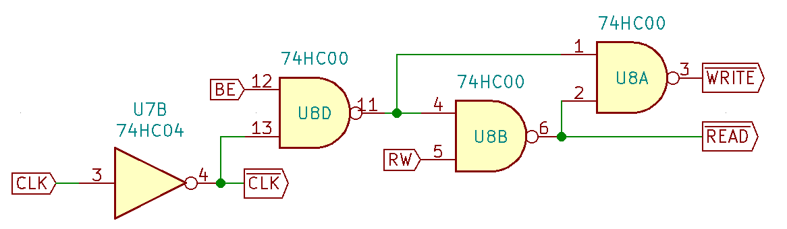

This section improves the output-enable and write-enable signals by gating them with the clock. It also includes a fix from a later Ben video (hooking up the VGA card), where we only want this behavior when the CPU is driving the bus.

**Note:** Just like Ben's build, there is a theoretical timing issue here. When the clock goes high at the end of a write cycle, the CPU will hold the address lines valid for a minimum of 10ns. However, the RAM requires that the `~WE` signal goes high at least 0ns before addresses change. Ben's build and the circuit above are not meeting the 10ns requirement because of gate propagation delay. The 74HC00 has a max propagation delay of around 20ns (typical 7), and the 74HC04 of 24ns (typical 8). It adds up to 84ns in the worst case and 29ns in the typical case. It seems to work fine, however. I'm guessing the 10ns limit is when running a 14Mhz? My next board will fix this using a fast GAL (`ATF22V10-7`, which has a 7ns propagation delay), as I'm not aware of a way to meet this timing requirement using individual logic gates.

## IRQ lines

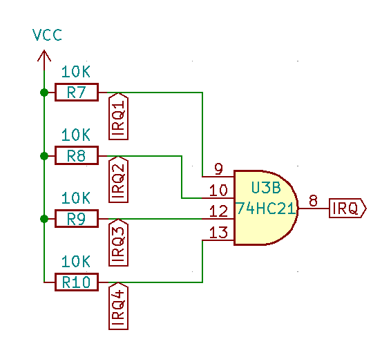

This section takes the four separate IRQ lines (one per I/O select line) and ANDs them together to create the processor IRQ line.

I'm using a 4-input AND gate here rather than wiring the signals together. Some of the devices for the 6502 processor have open-drain outputs (such as the W65C22N and older NMOS versions, also the W65C51). The W65C22S, however, has a full output driver that can output both logic 1 and 0. So it is best to isolate each IRQ line to prevent shorts. See the IRQ pin description on the W65C22S datasheet, page 31.

## Reset

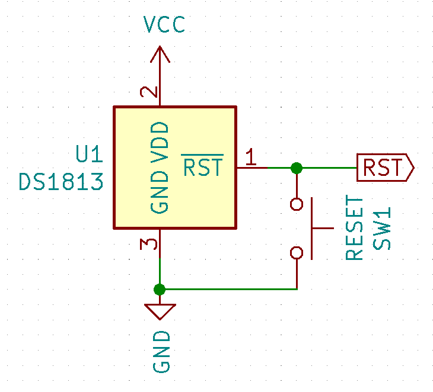

The board includes a DS1813 reset circuit. It detects when the power goes on and pulls `RST` low for 150ms to allow every device to properly boot up, so I don't have to reset the processor manually. Additionally, it debounces the reset button, generating a 150ms pulse each time it is pressed. Finally, if the supplied voltage goes below a defined value, it also pulls `RST` low, protecting the components from under-voltage.

## Clock

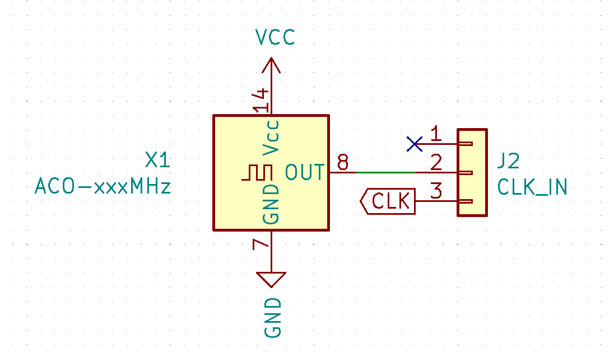

The board includes a built-in oscillator with a jumper to plug in an external clock (like Ben's clock module). I'm running the CPU at 4Mhz at the moment.

# BOM

| Ref                                     | Qnty | Value        | Datasheet                                                    | Description                                                  |
| --------------------------------------- | ---- | ------------ | ------------------------------------------------------------ | ------------------------------------------------------------ |
| C1                                      | 1    | 1uF          | ~                                                            | Polarized capacitor                                          |
| C2, C3, C4, C5, C6, C7, C8, C9, C10     | 9    | 0.1uF        | ~                                                            | Unpolarized capacitor                                        |
| J1                                      | 1    | PWR_IN       | ~                                                            | 01x02 female pin header                                      |
| J2                                      | 1    | CLK_IN       | ~                                                            | 01x03 female pin header                                      |
| J3                                      | 1    | I/O          | ~                                                            | 01x50 female pin header with long legs (use five 01x10 by trimming their ends) |
| R1, R2, R3, R4, R5, R6, R7, R8, R9, R10 | 10   | 10K          | ~                                                            | Resistor                                                     |
| SW1                                     | 1    | RESET        | ~                                                            | Push button switch, generic, four pins                       |
| U1                                      | 1    | DS1813       | https://datasheets.maximintegrated.com/en/ds/DS1813.pdf      | 5V Econoreset with push button                               |
| U2                                      | 1    | W65C02SxP    | http://www.westerndesigncenter.com/wdc/documentation/w65c02s.pdf | W65C02S 8-bit CMOS General Purpose Microprocessor            |
| U4                                      | 1    | CY62256-70PC | https://ecee.colorado.edu/~mcclurel/hm62256b.pdf             | 256K (32K x 8) Static RAM                                    |
| U5                                      | 1    | 28C256       | http://ww1.microchip.com/downloads/en/DeviceDoc/doc0006.pdf  | EEPROM 256Kb (32K x 8)                                       |
| U6                                      | 1    | 74HC133      | http://i2c2p.twibright.com/datasheet/74HC133_CNV_2.pdf       | NAND 13-input                                                |
| U9                                      | 1    | 74HC138      | http://www.ti.com/lit/gpn/sn74hc138                          | Decoder 3 to 8 active low outputs                            |
| U7                                      | 1    | 74HC04       | https://assets.nexperia.com/documents/data-sheet/74HC_HCT04.pdf | Hex Inverter                                                 |
| U8                                      | 1    | 74HC00       | http://www.ti.com/lit/gpn/sn74hc00                           | Quad 2-input NAND                                            |
| U3                                      | 1    | 74HC21       | https://www.ti.com/lit/ds/symlink/cd74hc21.pdf               | Dual 4-input AND                                             |
| X1                                      | 1    | 4MHz         |                                                              | HCMOS Crystal Clock Oscillator, DIP14-style metal package    |

## Notes from the build, future improvements

- Since a 1x50 pin header connector is impossible to find, I had to take five 1x10 connectors and join them together. Their sides are a bit bigger than the pin spacing, though, so I had to trim them using sandpaper. It makes them look a bit iffy, and for the next board, I'll go with a 40+10 with space in between
- If I pull the `RST` pin high during power-up by tying it to 5 volts with a jumper on the expansion port, I generate a short through the DS1813. Indeed, it drives the `RST` pin low by tying it to ground directly, without a current limiting resistor. In my next board, I'll add a small current limiting resistor in series between the DS1813 and the other components
- As mentioned above, the timing for the RAM is not theoretically met. In my next board, I'll use a fast GAL to implement the glue logic, which will solve the issue of propagation delays
- The board is definitely missing some blinkenlights :-) I tried to keep it as compact as possible. Maybe I'll include at least a power LED?
- I definitely should have left more space around the ZIF socket. It works as-is, but it is tight, and the handle rests against the CPU
- On the subject of the ZIF socket, I used a cheap Chinesium one, and it shows, the pin sockets don't open properly, which makes it a bit fiddly to insert a ROM chip
- I want to increase the number of I/O lines to 8 to give myself more room, as I already have 2 of them filled and more expansion on the way (ACIA, Video Chip, Programmable Clock ...)
- Address and data buses have their binary representation LSB-first on the expansion port. I might want to make this MSB-first
